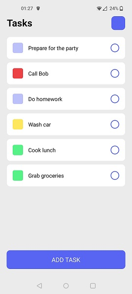

# doTasks

A simple to-do list application for mobile devices, made with React Native.

As this is my first project in React Native, I used mattfrances' [tutorial](https://github.com/mattfrances/simpleReactNativeTodoList) as a starting point. The app is now written in TypeScript, uses color code to mark a task's state, can store the tasks in device memory and can select multiple tasks for deletion, with drag-n-drop sorting being a nice possible future feature.

It has only been tested on an Android device. Since this is just a small hobby project, the app is not actively being maintained so, if you decide to use it, then please do so at your own discretion.
